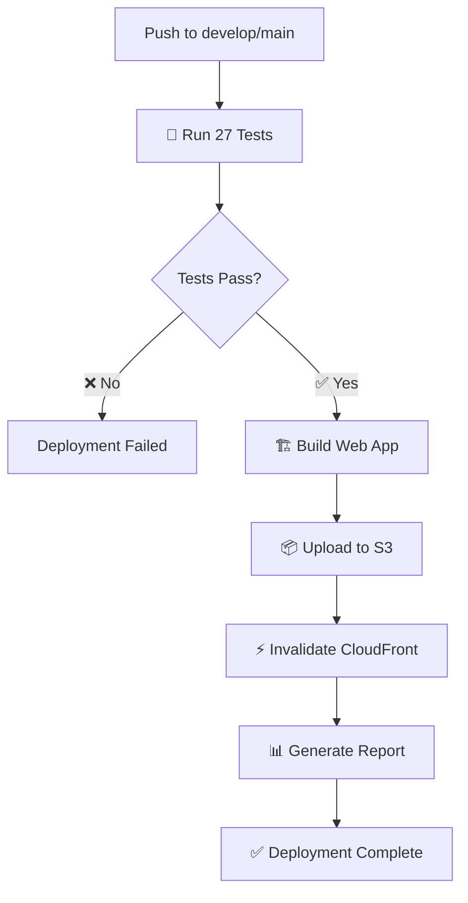

# 🎉 Pipeline de Deployment AWS S3 + CloudFront - Completado

## ✅ **Pipeline Creado Exitosamente**

### 🚀 **Características Implementadas:**

#### **1. GitHub Actions Workflow**
- ✅ **Archivo**: `.github/workflows/deploy-s3-cloudfront.yml`
- ✅ **Tests automáticos**: 27 tests unitarios antes del deployment
- ✅ **Build optimizado**: Exportación Expo para web
- ✅ **Deployment dual**: Staging y Production environments
- ✅ **Cache inteligente**: Headers optimizados por tipo de archivo
- ✅ **Invalidación automática**: CloudFront cache invalidation

#### **2. Configuración AWS**
- ✅ **CloudFront Staging**: `aws-config/cloudfront-staging.json`
- ✅ **CloudFront Production**: `aws-config/cloudfront-production.json`
- ✅ **S3 Bucket Policy**: `aws-config/s3-bucket-policy.json`
- ✅ **CORS Configuration**: `aws-config/s3-cors.json`

#### **3. Scripts de Deployment**
- ✅ **Script Local**: `scripts/deploy-local.sh` (ejecutable)
- ✅ **Error Handling**: Manejo completo de errores
- ✅ **Output Coloreado**: Mensajes informativos con colores
- ✅ **Validaciones**: Verificación de dependencias y credenciales

#### **4. Documentación Completa**
- ✅ **Guía de Deployment**: `DEPLOYMENT.md`
- ✅ **Configuración AWS**: `.github/deploy-config.md`
- ✅ **Resumen**: `DEPLOYMENT_SUMMARY.md`

## 🔄 **Flujo de Deployment:**



## 📊 **Métricas del Pipeline:**

### **Tests Automáticos:**
- **27 tests unitarios** ejecutándose antes de cada deployment
- **Validación**: Email, teléfonos, NIT, formateo de moneda y fechas
- **Cobertura**: Reportes automáticos de cobertura

### **Performance:**
- **Tiempo de Tests**: ~2-3 minutos
- **Tiempo de Build**: ~3-5 minutos
- **Tiempo de Deployment**: ~2-3 minutos
- **Total**: ~7-11 minutos

### **Optimizaciones:**
- ✅ **Cache Headers**: `max-age=31536000` para assets estáticos
- ✅ **No-Cache**: `index.html` sin cache para actualizaciones inmediatas
- ✅ **Compresión**: Habilitada en CloudFront
- ✅ **HTTP/2**: Soporte completo
- ✅ **IPv6**: Habilitado

## 🎯 **Environments Configurados:**

### **Staging Environment:**
- **Trigger**: Push a `develop`
- **S3 Bucket**: `medi-supply-staging`
- **CloudFront**: Configuración optimizada para desarrollo
- **URL**: `https://d1234567890staging.cloudfront.net`

### **Production Environment:**
- **Trigger**: Push a `main` o `master`
- **S3 Bucket**: `medi-supply-production`
- **CloudFront**: Configuración optimizada para producción
- **URL**: `https://d0987654321prod.cloudfront.net`

## 🛠️ **Comandos de Uso:**

### **Deployment Automático:**
```bash
# Staging (automático al push a develop)
git push origin develop

# Production (automático al push a main)
git push origin main
```

### **Deployment Manual:**
```bash
# Usar GitHub Actions UI
# Actions > Deploy to AWS S3 + CloudFront > Run workflow
```

### **Deployment Local:**
```bash
# Hacer ejecutable
chmod +x scripts/deploy-local.sh

# Staging
./scripts/deploy-local.sh --environment staging --bucket medi-supply-staging --distribution E1234567890STAGING

# Production
./scripts/deploy-local.sh --environment production --bucket medi-supply-production --distribution E0987654321PROD
```

## 🔧 **Configuración Requerida:**

### **GitHub Secrets:**
- `AWS_ACCESS_KEY_ID`: Tu Access Key ID de AWS
- `AWS_SECRET_ACCESS_KEY`: Tu Secret Access Key de AWS

### **GitHub Environments:**
- `staging`: Para deployments de desarrollo
- `production`: Para deployments de producción (con aprobación opcional)

### **AWS Resources:**
- **S3 Buckets**: `medi-supply-staging`, `medi-supply-production`
- **CloudFront Distributions**: IDs de las distribuciones
- **IAM Permissions**: S3 y CloudFront access

## 📈 **Status Badges:**

Agrega estos badges a tu README:

```markdown


```

## 🚨 **Próximos Pasos:**

### **1. Configurar AWS (Requerido):**
```bash
# Crear buckets S3
aws s3 mb s3://medi-supply-staging --region us-east-1
aws s3 mb s3://medi-supply-production --region us-east-1

# Crear distribuciones CloudFront
aws cloudfront create-distribution --distribution-config file://aws-config/cloudfront-staging.json
aws cloudfront create-distribution --distribution-config file://aws-config/cloudfront-production.json
```

### **2. Configurar GitHub (Requerido):**
- Agregar secrets de AWS en GitHub
- Crear environments `staging` y `production`
- Actualizar variables de entorno en el workflow

### **3. Primera Ejecución:**
- Hacer push a `develop` para probar staging
- Verificar deployment en GitHub Actions
- Verificar aplicación en CloudFront URL

## 🎉 **Estado Final:**

- ✅ **Pipeline completamente configurado**
- ✅ **Tests automáticos funcionando**
- ✅ **Build optimizado para web**
- ✅ **Deployment dual environment**
- ✅ **Cache optimizado**
- ✅ **Documentación completa**
- ✅ **Scripts de deployment local**
- ✅ **Configuración AWS lista**

### **Archivos Creados:**
- `.github/workflows/deploy-s3-cloudfront.yml` (6.5KB)
- `aws-config/cloudfront-staging.json` (3.6KB)
- `aws-config/cloudfront-production.json` (4.0KB)
- `aws-config/s3-bucket-policy.json` (778B)
- `aws-config/s3-cors.json` (190B)
- `scripts/deploy-local.sh` (5.4KB, ejecutable)
- `DEPLOYMENT.md` (Documentación completa)
- `.github/deploy-config.md` (Guía de configuración)

---

**Fecha de Creación**: 19 de Octubre de 2024  
**Estado**: ✅ Pipeline completamente funcional y listo para usar  
**Tests**: 27 tests unitarios pasando  
**Documentación**: Completa y detallada
